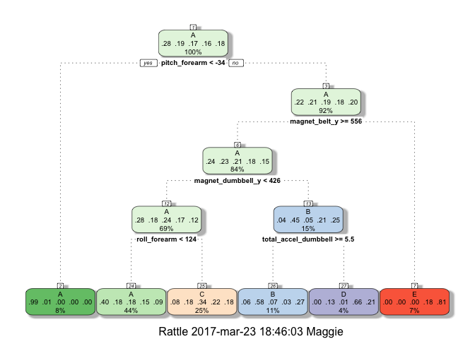

Loading Data
------------

    training <- read.csv("pml-training.csv", na.strings=c("", "NA", "NULL"))
    testing <- read.csv("pml-testing.csv", na.strings=c("", "NA", "NULL"))
    dim(training)

    FALSE [1] 19622   160

    dim(testing)

    FALSE [1]  20 160

Cleaning and Preparing Data
---------------------------

Remove variables that we believe have too many NA values.

    colSums(is.na(training))

    FALSE                        X                user_name     raw_timestamp_part_1 
    FALSE                        0                        0                        0 
    FALSE     raw_timestamp_part_2           cvtd_timestamp               new_window 
    FALSE                        0                        0                        0 
    FALSE               num_window                roll_belt               pitch_belt 
    FALSE                        0                        0                        0 
    FALSE                 yaw_belt         total_accel_belt       kurtosis_roll_belt 
    FALSE                        0                        0                    19216 
    FALSE      kurtosis_picth_belt        kurtosis_yaw_belt       skewness_roll_belt 
    FALSE                    19216                    19216                    19216 
    FALSE     skewness_roll_belt.1        skewness_yaw_belt            max_roll_belt 
    FALSE                    19216                    19216                    19216 
    FALSE           max_picth_belt             max_yaw_belt            min_roll_belt 
    FALSE                    19216                    19216                    19216 
    FALSE           min_pitch_belt             min_yaw_belt      amplitude_roll_belt 
    FALSE                    19216                    19216                    19216 
    FALSE     amplitude_pitch_belt       amplitude_yaw_belt     var_total_accel_belt 
    FALSE                    19216                    19216                    19216 
    FALSE            avg_roll_belt         stddev_roll_belt            var_roll_belt 
    FALSE                    19216                    19216                    19216 
    FALSE           avg_pitch_belt        stddev_pitch_belt           var_pitch_belt 
    FALSE                    19216                    19216                    19216 
    FALSE             avg_yaw_belt          stddev_yaw_belt             var_yaw_belt 
    FALSE                    19216                    19216                    19216 
    FALSE             gyros_belt_x             gyros_belt_y             gyros_belt_z 
    FALSE                        0                        0                        0 
    FALSE             accel_belt_x             accel_belt_y             accel_belt_z 
    FALSE                        0                        0                        0 
    FALSE            magnet_belt_x            magnet_belt_y            magnet_belt_z 
    FALSE                        0                        0                        0 
    FALSE                 roll_arm                pitch_arm                  yaw_arm 
    FALSE                        0                        0                        0 
    FALSE          total_accel_arm            var_accel_arm             avg_roll_arm 
    FALSE                        0                    19216                    19216 
    FALSE          stddev_roll_arm             var_roll_arm            avg_pitch_arm 
    FALSE                    19216                    19216                    19216 
    FALSE         stddev_pitch_arm            var_pitch_arm              avg_yaw_arm 
    FALSE                    19216                    19216                    19216 
    FALSE           stddev_yaw_arm              var_yaw_arm              gyros_arm_x 
    FALSE                    19216                    19216                        0 
    FALSE              gyros_arm_y              gyros_arm_z              accel_arm_x 
    FALSE                        0                        0                        0 
    FALSE              accel_arm_y              accel_arm_z             magnet_arm_x 
    FALSE                        0                        0                        0 
    FALSE             magnet_arm_y             magnet_arm_z        kurtosis_roll_arm 
    FALSE                        0                        0                    19216 
    FALSE       kurtosis_picth_arm         kurtosis_yaw_arm        skewness_roll_arm 
    FALSE                    19216                    19216                    19216 
    FALSE       skewness_pitch_arm         skewness_yaw_arm             max_roll_arm 
    FALSE                    19216                    19216                    19216 
    FALSE            max_picth_arm              max_yaw_arm             min_roll_arm 
    FALSE                    19216                    19216                    19216 
    FALSE            min_pitch_arm              min_yaw_arm       amplitude_roll_arm 
    FALSE                    19216                    19216                    19216 
    FALSE      amplitude_pitch_arm        amplitude_yaw_arm            roll_dumbbell 
    FALSE                    19216                    19216                        0 
    FALSE           pitch_dumbbell             yaw_dumbbell   kurtosis_roll_dumbbell 
    FALSE                        0                        0                    19216 
    FALSE  kurtosis_picth_dumbbell    kurtosis_yaw_dumbbell   skewness_roll_dumbbell 
    FALSE                    19216                    19216                    19216 
    FALSE  skewness_pitch_dumbbell    skewness_yaw_dumbbell        max_roll_dumbbell 
    FALSE                    19216                    19216                    19216 
    FALSE       max_picth_dumbbell         max_yaw_dumbbell        min_roll_dumbbell 
    FALSE                    19216                    19216                    19216 
    FALSE       min_pitch_dumbbell         min_yaw_dumbbell  amplitude_roll_dumbbell 
    FALSE                    19216                    19216                    19216 
    FALSE amplitude_pitch_dumbbell   amplitude_yaw_dumbbell     total_accel_dumbbell 
    FALSE                    19216                    19216                        0 
    FALSE       var_accel_dumbbell        avg_roll_dumbbell     stddev_roll_dumbbell 
    FALSE                    19216                    19216                    19216 
    FALSE        var_roll_dumbbell       avg_pitch_dumbbell    stddev_pitch_dumbbell 
    FALSE                    19216                    19216                    19216 
    FALSE       var_pitch_dumbbell         avg_yaw_dumbbell      stddev_yaw_dumbbell 
    FALSE                    19216                    19216                    19216 
    FALSE         var_yaw_dumbbell         gyros_dumbbell_x         gyros_dumbbell_y 
    FALSE                    19216                        0                        0 
    FALSE         gyros_dumbbell_z         accel_dumbbell_x         accel_dumbbell_y 
    FALSE                        0                        0                        0 
    FALSE         accel_dumbbell_z        magnet_dumbbell_x        magnet_dumbbell_y 
    FALSE                        0                        0                        0 
    FALSE        magnet_dumbbell_z             roll_forearm            pitch_forearm 
    FALSE                        0                        0                        0 
    FALSE              yaw_forearm    kurtosis_roll_forearm   kurtosis_picth_forearm 
    FALSE                        0                    19216                    19216 
    FALSE     kurtosis_yaw_forearm    skewness_roll_forearm   skewness_pitch_forearm 
    FALSE                    19216                    19216                    19216 
    FALSE     skewness_yaw_forearm         max_roll_forearm        max_picth_forearm 
    FALSE                    19216                    19216                    19216 
    FALSE          max_yaw_forearm         min_roll_forearm        min_pitch_forearm 
    FALSE                    19216                    19216                    19216 
    FALSE          min_yaw_forearm   amplitude_roll_forearm  amplitude_pitch_forearm 
    FALSE                    19216                    19216                    19216 
    FALSE    amplitude_yaw_forearm      total_accel_forearm        var_accel_forearm 
    FALSE                    19216                        0                    19216 
    FALSE         avg_roll_forearm      stddev_roll_forearm         var_roll_forearm 
    FALSE                    19216                    19216                    19216 
    FALSE        avg_pitch_forearm     stddev_pitch_forearm        var_pitch_forearm 
    FALSE                    19216                    19216                    19216 
    FALSE          avg_yaw_forearm       stddev_yaw_forearm          var_yaw_forearm 
    FALSE                    19216                    19216                    19216 
    FALSE          gyros_forearm_x          gyros_forearm_y          gyros_forearm_z 
    FALSE                        0                        0                        0 
    FALSE          accel_forearm_x          accel_forearm_y          accel_forearm_z 
    FALSE                        0                        0                        0 
    FALSE         magnet_forearm_x         magnet_forearm_y         magnet_forearm_z 
    FALSE                        0                        0                        0 
    FALSE                   classe 
    FALSE                        0

    training <- training [ , colSums(is.na(training)) == 0]
    dim(training)

    FALSE [1] 19622    60

Remove unrelevant variables. There are some unrelevant variables that
can be removed as they are unlikely to be related to dependent variable.

    library(dplyr)

    FALSE 
    FALSE Attaching package: 'dplyr'

    FALSE The following objects are masked from 'package:stats':
    FALSE 
    FALSE     filter, lag

    FALSE The following objects are masked from 'package:base':
    FALSE 
    FALSE     intersect, setdiff, setequal, union

    training <- select(training, -c(X, user_name, raw_timestamp_part_1, raw_timestamp_part_2, cvtd_timestamp, new_window, num_window))
    dim(training)

    FALSE [1] 19622    53

Remove near zero variance predictors using nearZeroVar from caret
library

    library(caret)

    FALSE Loading required package: lattice

    FALSE Loading required package: ggplot2

    training <- training[ ,nearZeroVar(training, saveMetrics = TRUE)$nzv == FALSE]

Remove highly correlated variables 90%

    corrMatrix <- cor(select(training, -classe))
    training <- training[ , -findCorrelation(corrMatrix)]
    dim(training)

    FALSE [1] 19622    46

We can now split data into training and cross validation. There's
already a testing set.

    set.seed(3333)
    inTrain <- createDataPartition(y = training$classe, p = 0.7, list = FALSE)
    validation <- training[-inTrain, ]
    training <- training[inTrain, ]

Model Fitting
-------------

### Predicting with random forest

Using train from the caret package takes too much time. That why I will
use the randomForest command from randomForest Package.

    set.seed(3333)
    library(randomForest)

    FALSE randomForest 4.6-12

    FALSE Type rfNews() to see new features/changes/bug fixes.

    FALSE 
    FALSE Attaching package: 'randomForest'

    FALSE The following object is masked from 'package:ggplot2':
    FALSE 
    FALSE     margin

    FALSE The following object is masked from 'package:dplyr':
    FALSE 
    FALSE     combine

    fit.rf <- randomForest(classe ~. , data=training)
    confusionMatrix(validation$classe, predict(fit.rf, validation))

    FALSE Confusion Matrix and Statistics
    FALSE 
    FALSE           Reference
    FALSE Prediction    A    B    C    D    E
    FALSE          A 1673    1    0    0    0
    FALSE          B    5 1129    5    0    0
    FALSE          C    0   10 1016    0    0
    FALSE          D    0    0   10  953    1
    FALSE          E    0    0    0    0 1082
    FALSE 
    FALSE Overall Statistics
    FALSE                                           
    FALSE                Accuracy : 0.9946          
    FALSE                  95% CI : (0.9923, 0.9963)
    FALSE     No Information Rate : 0.2851          
    FALSE     P-Value [Acc > NIR] : < 2.2e-16       
    FALSE                                           
    FALSE                   Kappa : 0.9931          
    FALSE  Mcnemar's Test P-Value : NA              
    FALSE 
    FALSE Statistics by Class:
    FALSE 
    FALSE                      Class: A Class: B Class: C Class: D Class: E
    FALSE Sensitivity            0.9970   0.9904   0.9855   1.0000   0.9991
    FALSE Specificity            0.9998   0.9979   0.9979   0.9978   1.0000
    FALSE Pos Pred Value         0.9994   0.9912   0.9903   0.9886   1.0000
    FALSE Neg Pred Value         0.9988   0.9977   0.9969   1.0000   0.9998
    FALSE Prevalence             0.2851   0.1937   0.1752   0.1619   0.1840
    FALSE Detection Rate         0.2843   0.1918   0.1726   0.1619   0.1839
    FALSE Detection Prevalence   0.2845   0.1935   0.1743   0.1638   0.1839
    FALSE Balanced Accuracy      0.9984   0.9941   0.9917   0.9989   0.9995

The method presents an accuracy of 0.9939 on the validation set which is
very good.

### Predicting with trees

Using the tree package

    set.seed(3333)
    library(tree)
    fit.tree <- tree(classe ~. , data=training)
    confusionMatrix(validation$classe, predict(fit.tree, validation, type = "class"))

    FALSE Confusion Matrix and Statistics
    FALSE 
    FALSE           Reference
    FALSE Prediction    A    B    C    D    E
    FALSE          A 1385  112  141   35    1
    FALSE          B  118  783  189   46    3
    FALSE          C   13   87  892   23   11
    FALSE          D   60   68  342  488    6
    FALSE          E   42  229  241   67  503
    FALSE 
    FALSE Overall Statistics
    FALSE                                           
    FALSE                Accuracy : 0.6884          
    FALSE                  95% CI : (0.6764, 0.7002)
    FALSE     No Information Rate : 0.3067          
    FALSE     P-Value [Acc > NIR] : < 2.2e-16       
    FALSE                                           
    FALSE                   Kappa : 0.6063          
    FALSE  Mcnemar's Test P-Value : < 2.2e-16       
    FALSE 
    FALSE Statistics by Class:
    FALSE 
    FALSE                      Class: A Class: B Class: C Class: D Class: E
    FALSE Sensitivity            0.8560   0.6122   0.4942  0.74052  0.95992
    FALSE Specificity            0.9323   0.9227   0.9672  0.90892  0.89200
    FALSE Pos Pred Value         0.8274   0.6874   0.8694  0.50622  0.46488
    FALSE Neg Pred Value         0.9447   0.8955   0.8121  0.96525  0.99563
    FALSE Prevalence             0.2749   0.2173   0.3067  0.11198  0.08904
    FALSE Detection Rate         0.2353   0.1331   0.1516  0.08292  0.08547
    FALSE Detection Prevalence   0.2845   0.1935   0.1743  0.16381  0.18386
    FALSE Balanced Accuracy      0.8941   0.7675   0.7307  0.82472  0.92596

Using the caret package

    set.seed(3333)
    library(caret)
    library(rattle)

    FALSE Please install GTK+ from http://r.research.att.com/libs/GTK_2.24.17-X11.pkg

    FALSE If the package still does not load, please ensure that GTK+ is installed and that it is on your PATH environment variable

    FALSE IN ANY CASE, RESTART R BEFORE TRYING TO LOAD THE PACKAGE AGAIN

    FALSE Rattle : une interface graphique gratuite pour l'exploration de données avec R.
    FALSE Version 4.1.0 Copyright (c) 2006-2015 Togaware Pty Ltd.
    FALSE Entrez 'rattle()' pour secouer, faire vibrer, et faire défiler vos données.

    fit.rpart <- train(classe ~. , data=training, method="rpart")

    FALSE Loading required package: rpart

    fancyRpartPlot(fit.rpart$finalModel)

    confusionMatrix(validation$classe, predict(fit.rpart, validation))

    FALSE Confusion Matrix and Statistics
    FALSE 
    FALSE           Reference
    FALSE Prediction    A    B    C    D    E
    FALSE          A 1508   37  128    0    1
    FALSE          B  440  373  283   42    1
    FALSE          C  470   30  525    0    1
    FALSE          D  366   24  327  166   81
    FALSE          E  213  154  290   64  361
    FALSE 
    FALSE Overall Statistics
    FALSE                                           
    FALSE                Accuracy : 0.4984          
    FALSE                  95% CI : (0.4855, 0.5112)
    FALSE     No Information Rate : 0.5093          
    FALSE     P-Value [Acc > NIR] : 0.9537          
    FALSE                                           
    FALSE                   Kappa : 0.3463          
    FALSE  Mcnemar's Test P-Value : <2e-16          
    FALSE 
    FALSE Statistics by Class:
    FALSE 
    FALSE                      Class: A Class: B Class: C Class: D Class: E
    FALSE Sensitivity            0.5032  0.60356  0.33806  0.61029  0.81124
    FALSE Specificity            0.9425  0.85457  0.88435  0.85783  0.86746
    FALSE Pos Pred Value         0.9008  0.32748  0.51170  0.17220  0.33364
    FALSE Neg Pred Value         0.6464  0.94838  0.78843  0.97846  0.98251
    FALSE Prevalence             0.5093  0.10501  0.26389  0.04622  0.07562
    FALSE Detection Rate         0.2562  0.06338  0.08921  0.02821  0.06134
    FALSE Detection Prevalence   0.2845  0.19354  0.17434  0.16381  0.18386
    FALSE Balanced Accuracy      0.7228  0.72906  0.61120  0.73406  0.83935

Using the tree package we get an accuracy of 70% whereas using the caret
package, we get an accuracy of 50%.

Applying Results on testing Set
-------------------------------

We choose the random forest model and predict classe on the testing set.

    predict(fit.rf, testing)

    FALSE  1  2  3  4  5  6  7  8  9 10 11 12 13 14 15 16 17 18 19 20 
    FALSE  B  A  B  A  A  E  D  B  A  A  B  C  B  A  E  E  A  B  B  B 
    FALSE Levels: A B C D E
